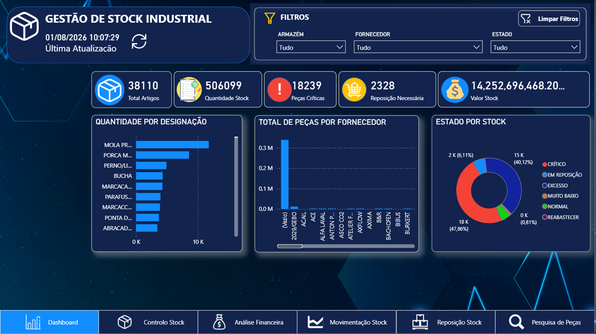
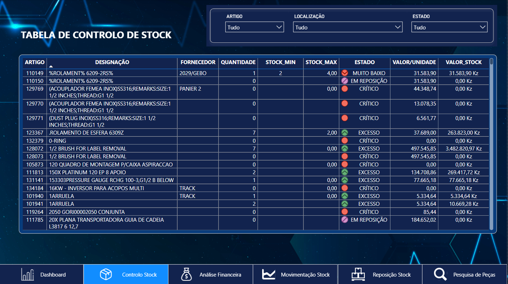
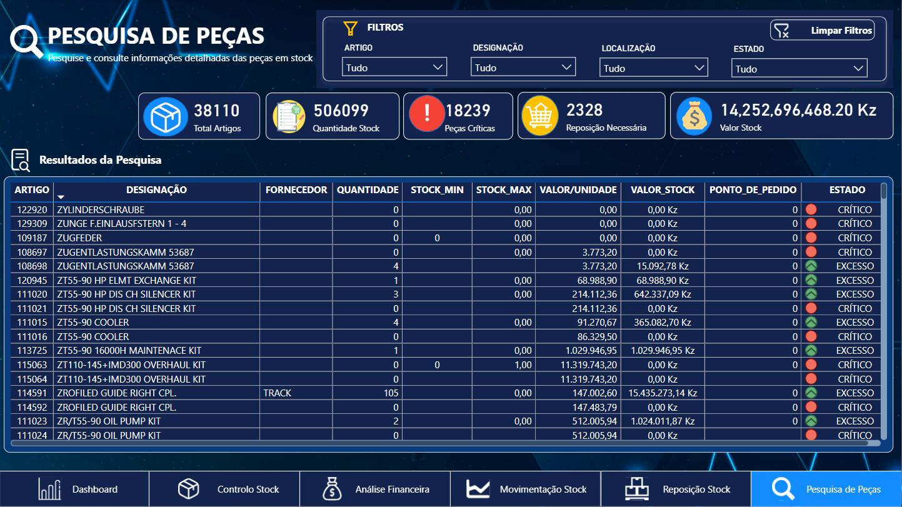
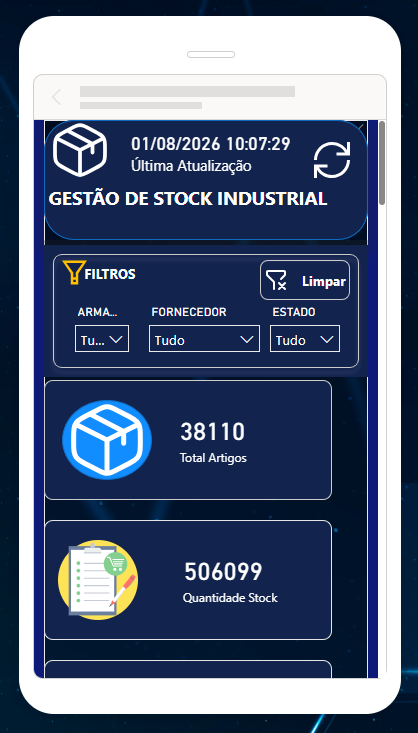

  

<h1 align="center">Dashboard de Gestão de Stock - Power BI</h1>

# 📦 Power BI Inventory Management Dashboard

## 📊 Project Overview

This project presents an interactive **Power BI dashboard developed for inventory management and stock analysis**.

The objective is to transform raw inventory data into meaningful insights, helping maintenance and operational teams monitor:

- Stock availability
- Inventory value
- Critical items
- Supplier analysis
- Spare parts management

## 🎯 Business Objectives

- Monitor total inventory value
- Identify high-value spare parts
- Analyse stock availability
- Support maintenance planning decisions
- Improve inventory visibility

## 🛠️ Tools & Technologies

| Tool | Purpose |
|---|---|
| Power BI | Dashboard development and data visualization |
| Excel | Data preparation and modelling |
| DAX | Measures and KPIs creation |
| Power Query | Data transformation |

## 📸 Dashboard Preview

## 📌 Project Overview

This project presents an interactive Power BI dashboard developed for inventory management and stock analysis.

The objective is to provide clear visibility of stock levels, inventory value, suppliers, and critical items to support maintenance and operational decision-making.

---

## 🎯 Objectives

- Monitor inventory value
- Analyse stock availability
- Identify high-value spare parts
- Support maintenance planning decisions
- Improve stock visibility

---

## 📊 Dashboard Features

### Executive Dashboard

- Total number of parts
- Total stock quantity
- Total inventory value
- Number of suppliers
- Latest data update indicator

### Stock Analysis

- Stock value by status
- Quantity analysis by supplier
- Inventory distribution by category

### Spare Parts Analysis

- Top 10 most expensive items
- Article search functionality
- Reference and description lookup

### Mobile Layout

Optimized mobile view for quick access to key indicators.

---

## 🛠️ Technologies Used

- Microsoft Power BI
- Power Query
- DAX
- Microsoft Excel

---

## 📈 Key Indicators (KPIs)

- Total Parts
- Total Quantity
- Total Stock Value
- Average Value per Reference
- Supplier Analysis

---

## 📷 Dashboard Preview

## Dashboard

### Visão Geral

### Análise de Stock

### Pesquisa Artigos

### Vista Mobile

---

## 📂 Project Files

📄 Data Source  
`Ficha_de_stock_fiticio.xlsx`

📘 Documentation  
`README.md`

📊 Power BI Dashboard  
`Stock industrial_Projeto1.pbix`
